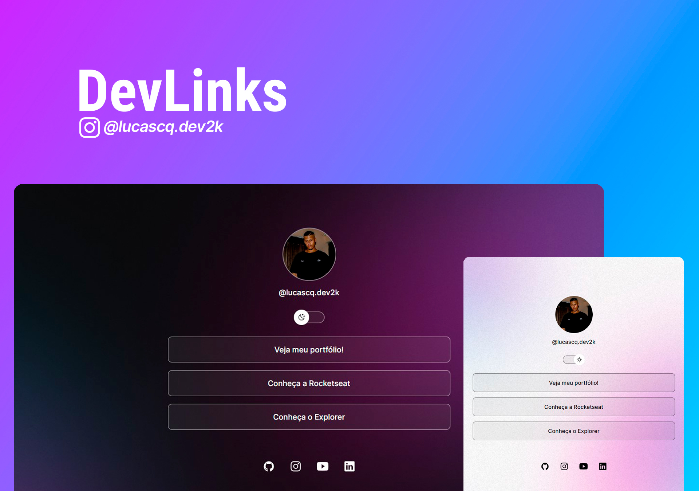

<h1 align="center"> My Devlinks </h1>

Curso exclusivo e gratuito desenvolvido pela Rocketseat para o ensino de tecnologias WEB.

  <a href="#-tecnologias">Tecnologias</a>&nbsp;&nbsp;&nbsp;|&nbsp;&nbsp;&nbsp;
  <a href="#-projeto">Projeto</a>&nbsp;&nbsp;&nbsp;|&nbsp;&nbsp;&nbsp;
  <a href="#-layout">Layout</a>&nbsp;&nbsp;&nbsp;|&nbsp;&nbsp;&nbsp;
  <a href="#memo-licença">Licença</a>

  

 

  

## 🚀 Tecnologias

Esse projeto foi desenvolvido com as seguintes tecnologias:

- HTML e CSS
- JavaScript
- Git e Github
- Figma

## 💻 Projeto

O Devlinks agrega todos os links necessários para ser um
cartão de visita completamente online.

- [Acesse o projeto finalizado, online](https://fxharry.github.io/mydevlinks/) 

## 🔖 Layout

Você pode visualizar o layout do projeto através [DESSE LINK](https://www.figma.com/file/J1Z33MISC22YZB8wfxiIns/NLW-Copa-Explorer/duplicate). É necessário ter conta no [Figma](https://figma.com) para acessá-lo.

## :memo: Licença

Esse projeto está sob a licença MIT.

---

Feito com 💖 juntamente com a Rocketseat :wave: [Participe da comunidade Rocketseat!](https://discord.gg/rocketseat)
